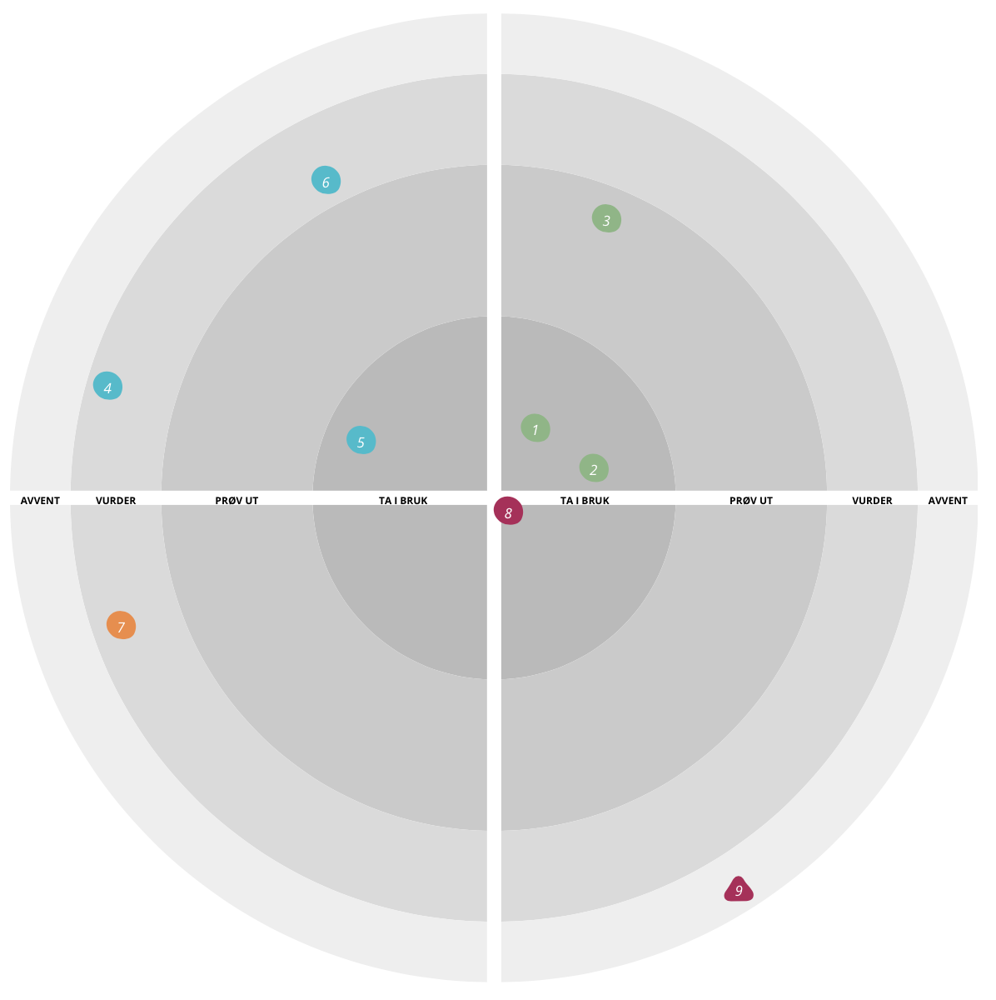

# SSBs teknologiradar

En teknologiradar skal gi veiledning på egnethet av prefererte teknologier. Den har en rolle både i å beskrive nåværende praksis og erfaringer samtidig som den former fremtidige teknologivalg. Det primære publikumet er utviklere i IT avdelingen i SSB. Alle utviklere er oppfordret til å holde radaren oppdatert, om det er en ny teknologi som burde legges til, eller en gammel som burde fases ut. Forslagene vurderes løpende av Tech Lead forumet i SSB. Radaren er hostet på SSBs Backstage instans: [SSBs teknologiradar](https://backstage.intern.ssb.no/tech-radar)

## Hvordan bidra med forslag til teknologier

Radarløsningen vi bruker genererer radaren automatisk ved å lese en [fil](./teknologiradar.json) som ligger i dette repoet. Hvis du ønsker å bidra, kan du sende forslag til teknologier ved å klone dette repoet, lage en ny *branch*, gjøre endringer i filen, og deretter lage en PR. Redaksjonen vil vurdere forslaget og publisere de nye endringene i repoets *main branch*.

For de som ikke er kjent med denne typen arbeidsflyt, kalt [GitHub flow](https://docs.github.com/en/get-started/quickstart/github-flow), så er det også mulig å sende forslag til oss på 

---

## Informasjon om filstrukturen

[Strukturen til JSON fila er definert her.](https://github.com/backstage/community-plugins/tree/main/workspaces/tech-radar/plugins/tech-radar#tech-radar-data-model) I skrivende stund har vi ingen validering på formatet så det gjelder å være forsiktig og teste endringer manuelt. Herme gjerne etter formatet til eksisterende innlegg.

---

## Hvordan lese teknologiradaren

Radaren består av tre ringer og er delt inn i fire kvadranter. Disse er representert av verdiene i kolonnene `ring` og `quadrant` i *json* fila over.

Inndelingen vi benytter er *veldig* inspirert av [Oslo Origo sin tech-radar](https://developer.oslo.kommune.no/teknologiradar/index.html).

### Beskrivelse av *ringene* i teknologiradaren

Hver *ring* kan sees på som et modenhetsnivå for teknologien. Å plassere en teknologi innenfor et modenhetsnivå vil alltid være en krevende øvelse, og hvor kompetanse og erfaring vil være en viktig faktor i vurderingen.

`Bruk` \
Teknologier som ligger i denne *ringen* har høyeste modenhetsnivå. Produktteamene i SSB bør ta i bruk disse teknologiene/verktøyene i produksjonsmiljøet. Teknologier innenfor dette modenhetsnivået har vært testet og vurdert for konkrete bruksområder, og er mest sannsynlig allerede satt i produksjon hos et eller flere teams. **Team som velger å ta i bruk disse teknologiene må fortsatt gjøre egne vurderinger knyttet til forretningsbehov, informasjonssikkerhet og arkitekturbeslutninger.**

`Vurder` \
Teknologier i denne *ringen* har ikke stor nok utbredelse. Det kan være mange grunner til det, både positive og negative. Som regel vil det være noe usikkerhet knyttet til modenheten på disse teknologiene. Det anbefales derfor at teammedlemmer eksperimenterer med disse og foreta grundige vurderinger før de eventuelt tas i bruk

`Avstå` \
Det er knyttet stor usikkerhet til teknologiene i denne *ringen*. Det kan være flere grunner til at modenheten vurderes som lav. F.eks. at teknologien er på vei "ut av markedet". Det anbefales å vente med å ta i bruk disse teknologiene.

### Beskrivelse av *kvadrantene* i teknologiradaren

*Kvadranetene* i radaren tilsvarer en kategori som avgrenser teknologienes bruksområde. Kategoriene gjenspeiler SSBs forretningsområdet slik det er skissert i SSBs virksomhetsmodell.

`Programmering` \
Kodespråk, rammeverk, biblioteker, testrammeverk osv.

`DevOps` \
Verktøy og systemer som ikke inngår i selve kodeartifakten, men bidrar til kvalitetskontroll, utrulling, monitorering osv.

`Infrastruktur` \
Tredjeparts systemer/plattform som programvaresystemer utviklet i SSB er avhengig av under kjøretid.

`Sikkerhet` \
Alt som er relatert til sikkerhet.

### Beste praksis for å beskrive en teknologi i radaren

Beskrivelsene burde bestå i det minste av:

1. En kort introduksjon av hvilket problem teknologien løser.
2. Styker og svakheter ved teknologien som fremhever hvorfor den er valgt.
3. En lenke til hvor man finner mer informasjon om teknologien.
4. Eventuelle erfaringer fra eksperimentering eller bruk i prod i SSB.
